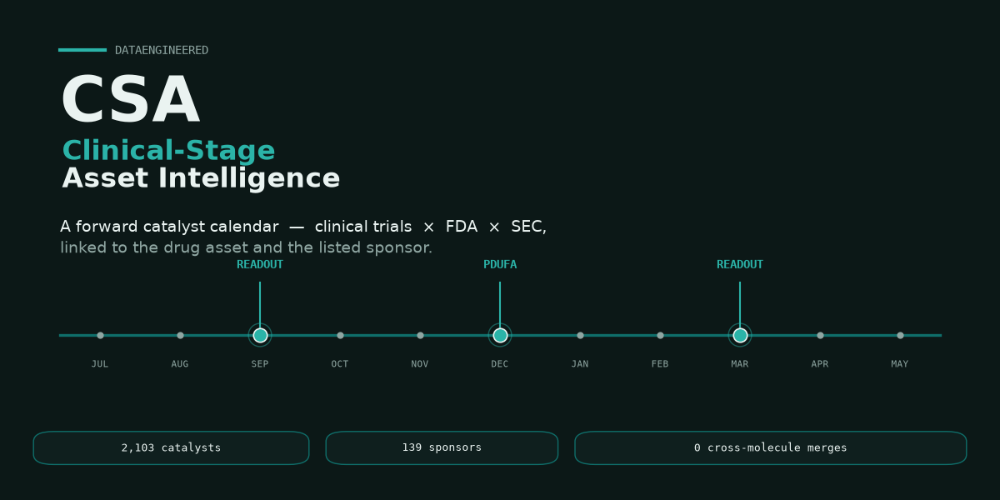

<div align="center">



# 🧬 CSA — Clinical-Stage Asset Intelligence

**Clinical trials, FDA and SEC — linked to the drug _asset_ and the _listed sponsor_, with a forward catalyst calendar · 2,103 catalysts · 139 sponsors · 1,841 resolved assets · 0 cross-molecule merges**

[](samples/catalyst_calendar_sample.csv)
[](https://www.kaggle.com/datasets/ahtiticheamine/csa-clinical-stage-asset-intelligence-sample)
[](https://huggingface.co/datasets/Ichlibitiche/csa-clinical-stage-asset-intelligence-sample)
[](https://www.kaggle.com/code/ahtiticheamine/csa-clinical-stage-asset-intelligence-starter)
[](CHANGELOG.md)
[](#how-the-linkage-is-built)
[](https://csa-public.pages.dev)

**[→ Get the full dataset at csa-public.pages.dev](https://csa-public.pages.dev)**

</div>

---

CSA links four public sources — **ClinicalTrials.gov**, **openFDA / Drugs@FDA**, **SEC EDGAR** and **FDA GSRS/UNII** — down to the individual **drug asset** and the **listed sponsor** behind it, and compiles a **forward catalyst calendar**: the upcoming trial readouts and FDA decision dates that move clinical-stage biotech, each with a graded date and a **source URL** so every row can be re-verified.

The guiding principle is **precision over recall**: a *wrong* asset↔ticker link is far more damaging than a missed one. Assets are keyed to their FDA-registered **active-moiety UNII set** (not fuzzy name matching), and a post-clustering guard means **no asset spans two different active moieties** — audited to **0 cross-molecule merges** on the full run. Uncertain pairs are held for review rather than merged.

> ⚠️ **Data, not investment advice.** CSA is information, not a recommendation to buy, sell, or hold any security. Estimated catalyst dates (e.g. protocol primary-completion dates) **routinely slip** and are graded by `confidence` — verify anything material against the `source_url` on each row before acting.

## What's inside

| | Full snapshot | Free sample |
| :--- | ---: | ---: |
| Forward catalysts | **2,103** | 150 |
| Listed sponsors | **139** | 50 |
| Resolved assets | **1,841** | 108 |
| Asset↔ticker "tradeable core" | **627** | (subset) |
| Trials resolved | **2,268** | (linked) |
| Formats | CSV · JSON | CSV |

The free [`samples/catalyst_calendar_sample.csv`](samples/catalyst_calendar_sample.csv) is the **150 nearest-term catalysts** across 50 listed sponsors — a real taste of the schema and quality — with the [`samples/asset_master_sample.csv`](samples/asset_master_sample.csv) linkage rows behind them. Explore it on the [Kaggle dataset](https://www.kaggle.com/datasets/ahtiticheamine/csa-clinical-stage-asset-intelligence-sample) (with a [starter notebook](https://www.kaggle.com/code/ahtiticheamine/csa-clinical-stage-asset-intelligence-starter)) or the [🤗 Hugging Face dataset](https://huggingface.co/datasets/Ichlibitiche/csa-clinical-stage-asset-intelligence-sample). The full snapshot is at **[csa-public.pages.dev](https://csa-public.pages.dev)**.

## Scope (the honest version)

The v1 snapshot is deliberately scoped, and says so up front:

- **Coverage:** active, **industry-sponsored, Phase 3, interventional** trials in **cardiometabolic, oncology and immunology**. Phase 2 and additional therapeutic areas are the documented monthly expansion.
- **Catalyst channels:** two, and every row names its own — `sec_8k` (dates disclosed in SEC 8-K filings) and `clinicaltrials` (active late-phase protocol primary-completion estimates). Company-disclosed exact dates rank above protocol estimates.
- **Confidence, not certainty:** every catalyst carries a `confidence` grade and a `date_precision`. Protocol dates slip; they are never presented as commitments.
- **Redistribution-clean:** every primary source is U.S. Government / public domain. No license-encumbered source (DrugBank, ChEMBL, MedDRA) is included.

## How the linkage is built

- **Active-moiety resolution.** Each asset is keyed to its FDA-registered **UNII set** via GSRS, not fuzzy names. A post-clustering moiety-consistency guard means one asset never spans two complete moieties — **0 cross-molecule merges** audited on the full run; ambiguous pairs are held for review, never auto-merged.
- **Sponsor → listed ticker.** Lead sponsors are resolved through acquisitions to the **primary US listing**, so the asset maps to the security you can actually trade.
- **Dual-channel catalysts.** SEC 8-K disclosure text + active late-phase ClinicalTrials.gov protocol readouts, each row stamped with its `source` and a `source_url`.

See [`DATA_DICTIONARY.md`](DATA_DICTIONARY.md) for every field and [`SOURCES.md`](SOURCES.md) for the upstream licenses.

## Pricing

| Tier | What | Price |
| :--- | :--- | :--- |
| **Sample** | 150 nearest-term catalysts (this repo) | Free |
| **Snapshot** | Full 2,103 catalysts · 1,841 assets · 627 tradeable-core · CSV + JSON · commercial license | **$499** one-time |
| **API & Enterprise** | Monthly refresh + delta feed · Phase 2 & more areas · API delivery · custom gold sets | **Let's talk** |

**[→ Get it at csa-public.pages.dev](https://csa-public.pages.dev)** · or email **[roasterdb@proton.me](mailto:roasterdb@proton.me)** for API / enterprise / invoice.

## Use cases

- Biotech-focused funds & analysts — a forward catalyst calendar keyed to tradeable tickers
- Event-driven screening — trial readouts and PDUFA dates as structured, sourced rows
- Competitive/landscape intelligence — asset ↔ sponsor ↔ trial maps across a therapeutic area
- ML / RAG corpora over clinical-stage pipelines and their listed sponsors

## Quick look

```python
import csv
rows = list(csv.DictReader(open("samples/catalyst_calendar_sample.csv", encoding="utf-8")))
print(len(rows), "catalysts across", len({r["ticker"] for r in rows}), "sponsors")
# → 150 catalysts across 50 sponsors
soonest = min(rows, key=lambda r: r["event_date"])
print(soonest["event_date"], soonest["ticker"], soonest["asset"], soonest["event_type"])
```

A fuller example is in [`examples/load_sample.py`](examples/load_sample.py).

## License

- **Sample data & docs in this repo:** CC-BY-NC-4.0 — free to use and share with attribution, non-commercial (see [`LICENSE`](LICENSE)).
- **Full dataset:** commercial license, available at [csa-public.pages.dev](https://csa-public.pages.dev). Distributed as derived factual attributes with per-row source attribution.
- **Not investment advice.** CSA is a dataset, not a recommendation. Estimated dates slip; verify against each row's `source_url`.

Spotted a wrong asset↔ticker link or a slipped date? Email **[roasterdb@proton.me](mailto:roasterdb@proton.me)** — linkage corrections are the highest priority.
