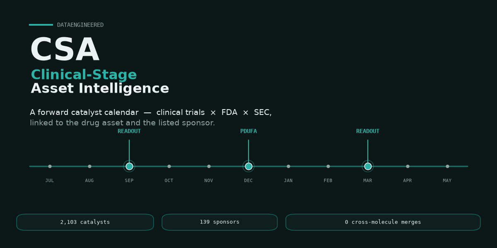

<div align="center">



# 🧬 CSA — Clinical-Stage Asset Intelligence

**Clinical trials, FDA and SEC — linked to the drug _asset_ and the _listed sponsor_, with a forward catalyst calendar · 2,202 catalysts (955 ticker-linked) · 126 listed sponsors · 1,881 resolved assets · 0 cross-molecule merges**

[](samples/catalyst_calendar_sample.csv)
[](https://www.kaggle.com/datasets/dataengineered/csa-clinical-stage-asset-intelligence-sample)
[](https://huggingface.co/datasets/Ichlibitiche/csa-clinical-stage-asset-intelligence-sample)
[](https://www.kaggle.com/code/dataengineered/csa-clinical-stage-asset-intelligence-starter)
[](CHANGELOG.md)
[](#how-the-linkage-is-built)
[](https://csa.dataengineered.io)

**[→ Get the full dataset at csa.dataengineered.io](https://csa.dataengineered.io)**

**Free sample:** [150 catalysts](samples/catalyst_calendar_sample.csv) · **Full dataset: $499 one-time** → [Buy on Stripe](https://buy.stripe.com/dRmcN67BefzwazV2I83840d)

</div>

---

CSA links four public sources — **ClinicalTrials.gov**, **openFDA / Drugs@FDA**, **SEC EDGAR** and **FDA GSRS/UNII** — down to the individual **drug asset** and the **listed sponsor** behind it, and compiles a **forward catalyst calendar**: the upcoming trial readouts and FDA decision dates that move clinical-stage biotech, each with a graded date and a **source URL** so every row can be re-verified.

The guiding principle is **precision over recall**: a *wrong* asset↔ticker link is far more damaging than a missed one. Assets are keyed to their FDA-registered **active-moiety UNII set** (not fuzzy name matching), and a post-clustering guard means **no asset spans two different active moieties** — audited to **0 cross-molecule merges** on the full run. Uncertain pairs are held for review rather than merged.

> ⚠️ **Data, not investment advice.** CSA is information, not a recommendation to buy, sell, or hold any security. Estimated catalyst dates (e.g. protocol primary-completion dates) **routinely slip** and are graded by `confidence` — verify anything material against the `source_url` on each row before acting.

## What's inside

| | Full snapshot | Free sample |
| :--- | ---: | ---: |
| Forward catalysts | **2,202** (955 ticker-linked) | 150 |
| Listed sponsors | **126** | 47 |
| Resolved assets | **1,881** | 106 |
| Asset↔ticker "tradeable core" | **603** | (subset) |
| Trials resolved | **2,332** | (linked) |
| Formats | CSV · JSON | CSV |

The free [`samples/catalyst_calendar_sample.csv`](samples/catalyst_calendar_sample.csv) is the **150 nearest-term catalysts** across 47 listed sponsors — a real taste of the schema and quality — with the [`samples/asset_master_sample.csv`](samples/asset_master_sample.csv) linkage rows behind them. Explore it on the [Kaggle dataset](https://www.kaggle.com/datasets/dataengineered/csa-clinical-stage-asset-intelligence-sample) (with a [starter notebook](https://www.kaggle.com/code/dataengineered/csa-clinical-stage-asset-intelligence-starter)) or the [🤗 Hugging Face dataset](https://huggingface.co/datasets/Ichlibitiche/csa-clinical-stage-asset-intelligence-sample). The full snapshot is at **[csa.dataengineered.io](https://csa.dataengineered.io)**.

## Scope (the honest version)

The v1 snapshot is deliberately scoped, and says so up front:

- **Coverage:** active, **industry-sponsored, Phase 3, interventional** trials in **cardiometabolic, oncology and immunology**. Phase 2 and additional therapeutic areas are planned, not yet shipped.
- **Catalyst channels:** two, and every row names its own — `sec_8k` (dates disclosed in SEC 8-K filings) and `clinicaltrials` (active late-phase protocol primary-completion estimates). Company-disclosed exact dates rank above protocol estimates.
- **Confidence, not certainty:** every catalyst carries a `confidence` grade and a `date_precision`. Protocol dates slip; they are never presented as commitments.
- **Redistribution-clean:** every primary source is U.S. Government / public domain. No license-encumbered source (DrugBank, ChEMBL, MedDRA) is included.

## How the linkage is built

- **Active-moiety resolution.** Each asset is keyed to its FDA-registered **UNII set** via GSRS, not fuzzy names. A post-clustering moiety-consistency guard means one asset never spans two complete moieties — **0 cross-molecule merges** audited on the full run; ambiguous pairs are held for review, never auto-merged.
- **Sponsor → listed ticker.** Lead sponsors are resolved through acquisitions to the **primary US listing**, so the asset maps to the security you can actually trade.
- **Dual-channel catalysts.** SEC 8-K disclosure text + active late-phase ClinicalTrials.gov protocol readouts, each row stamped with its `source` and a `source_url`.

See [`DATA_DICTIONARY.md`](DATA_DICTIONARY.md) for every field and [`SOURCES.md`](SOURCES.md) for the upstream licenses.

## Pricing

| Tier | What | Price |
| :--- | :--- | :--- |
| **Sample** | 150 nearest-term catalysts (this repo) | Free |
| **Snapshot** | Full 2,202 catalysts (955 ticker-linked) · 1,881 assets · 603 tradeable-core · CSV + JSON · commercial license | **$499** one-time |
| **API & enterprise terms** | New editions · Phase 2 & more areas · API delivery · custom gold sets — use the [contact form](https://csa.dataengineered.io/#contact) | quoted per engagement |

**[→ Get it at csa.dataengineered.io](https://csa.dataengineered.io)** · or use the [contact form](https://csa.dataengineered.io/#contact) (csa@dataengineered.io) for API / enterprise / invoice.

## Use cases

- Biotech-focused funds & analysts — a forward catalyst calendar keyed to tradeable tickers
- Event-driven screening — trial readouts and PDUFA dates as structured, sourced rows
- Competitive/landscape intelligence — asset ↔ sponsor ↔ trial maps across a therapeutic area
- ML / RAG corpora over clinical-stage pipelines and their listed sponsors

## Quick look

```python
import csv
rows = list(csv.DictReader(open("samples/catalyst_calendar_sample.csv", encoding="utf-8")))
print(len(rows), "catalysts across", len({r["ticker"] for r in rows}), "sponsors")
# → 150 catalysts across 47 sponsors
soonest = min(rows, key=lambda r: r["event_date"])
print(soonest["event_date"], soonest["ticker"], soonest["asset"], soonest["event_type"])
```

A fuller example is in [`examples/load_sample.py`](examples/load_sample.py).

## Site pages

`python scripts/generate_seo_pages.py` builds the site from `samples/` in one run: one page
per catalyst asset (`catalysts/`) and per listed sponsor (`sponsors/`), the two directory
hubs, the homepage sample-calendar rows, the redirect map in `functions/_middleware.js`
and `sitemap.xml` (written last). Sponsor pages also show the sponsor's counts in the full
snapshot from `data/sponsor_summary.json` (copied from csa-poc `site/` each edition).

- A page whose asset or sponsor left the sample is deleted by that run, so never delete
  catalyst or sponsor pages by hand. The run checks everything before it writes, and
  refuses to delete more than a third of either directory unless given `--force-prune`.
- Only forward catalysts are shown: rows dated before the run (or `CSA_AS_OF=YYYY-MM-DD`)
  are skipped, and the homepage table lists catalysts at least a month out.
- A retired URL with a true successor (a renamed or merged asset) belongs in
  `scripts/redirects.json`. The middleware serves the active rules (Cloudflare Pages does
  not apply `_redirects` to requests a Function serves). A rule whose target page is gone
  stays recorded but inactive, and a URL with no successor simply returns 404.

## Localized pages (i18n)

The homepage and the 404 page (`index.html`, `404.html`) are also published under `/es/`,
`/de/`, `/fr/` and `/pt-br/`. Catalyst, sponsor and directory pages are English-only since
2026-10-08; the middleware 301s their former translated URLs to the English page. Those
copies are generated by `scripts/i18n_common.py` (config in `i18n.config.json`,
translations in `locales/<lang>.json`). The English pages at the root stay the source of
truth, so never hand-edit the `<lang>/` directories.

- After regenerating the English pages (`python scripts/generate_seo_pages.py`) or
  editing `index.html`, run `python scripts/i18n_common.py build`, then
  `python scripts/i18n_common.py check` (must report 0 errors).
- New or changed copy: `python scripts/i18n_common.py todo`, translate the todo files per
  the portfolio's `scripts/i18n_style.md`, `merge` them, then `build` and `check` again.
  Data values (assets, sponsors, tickers, NCT ids, CSV enums) are marked
  `translate="no"` in the generators and stay verbatim.

## License

- **Sample data & docs in this repo:** CC-BY-NC-4.0 — free to use and share with attribution, non-commercial (see [`LICENSE`](LICENSE)).
- **Full dataset:** commercial license, available at [csa.dataengineered.io](https://csa.dataengineered.io). Distributed as derived factual attributes with per-row source attribution.
- **Not investment advice.** CSA is a dataset, not a recommendation. Estimated dates slip; verify against each row's `source_url`.

Spotted a wrong asset↔ticker link or a slipped date? Use the [contact form](https://csa.dataengineered.io/#contact) or write to csa@dataengineered.io — linkage corrections are the highest priority.
